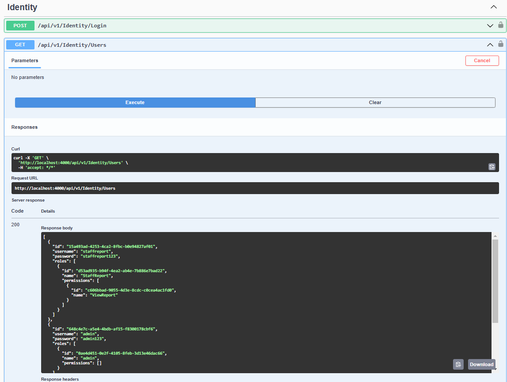
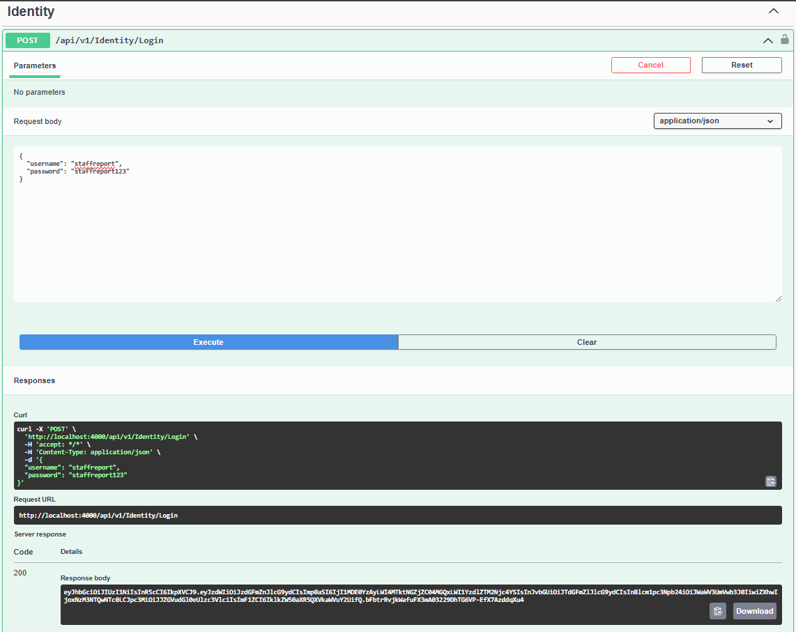
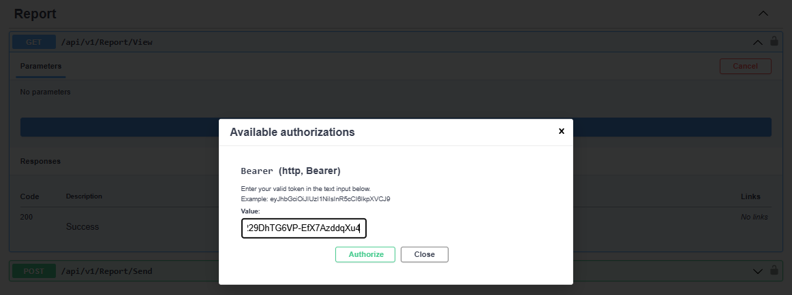
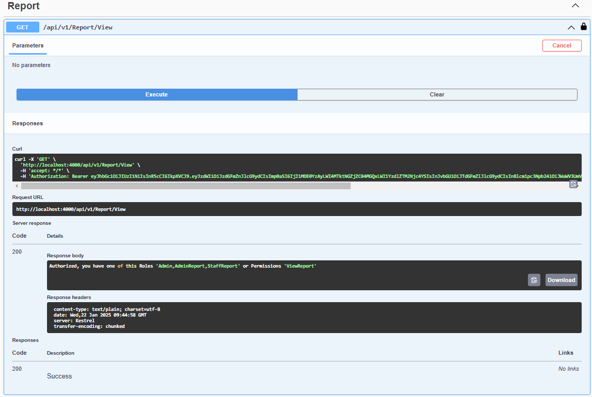
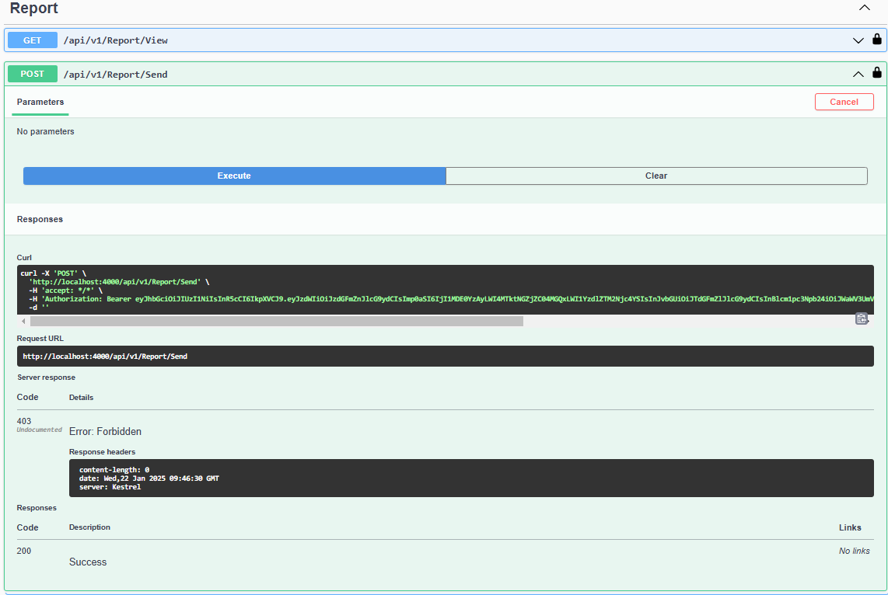

# rbac-access-control
Simple Role-Based Access Control (RBAC) API using .NET

## How to run locally
Clone the repository to your directory
```bash
  git clone https://github.com/alshadev/rbac-access-control.git
```
Go and run Identity.API project
```bash
  cd src\backend\identity\Identity.API
  dotnet run
```
after run successfully, please open http://localhost:4000/swagger/index.html so you able to test the endpoints.

## How to test the endpoints
1. after the Swagger is open, you can see there are 3 endpoints (Contract, Identity and Report)
2. I have pre-created some users, roles, and permissions. so you can get username and password by calling the following endpoint
   
3. Get token by calling the following endpoint, you can see in response body is token (I use JWT)
   
4. Login by click lock image (on the top right of the endpoint), you can input the token from previous to form then click Authorize
   
5. You can logout and re-login by using different user token if you want
6. Try calling the endpoint, If the user is successfully authenticated, the display will look like this with a response code of 200.
   
7. If the user fails authentication, the display will look like this with a response code of 403.
   
8. I have also created an endpoint to create users, roles and permissions. So you can try to create new users, roles and permissions to call the contract endpoint.
   Allowed Role and Permission is like this:
   View: Role (Admin/AdminContract), Permission (ViewContract).
   Create: Role (Admin/AdminContract), Permission (CreateContract).
   Update: Role (Admin/AdminContract), Permission (UpdateContract).
   Delete: Role (Admin/AdminContract), Permission (DeleteContract).
